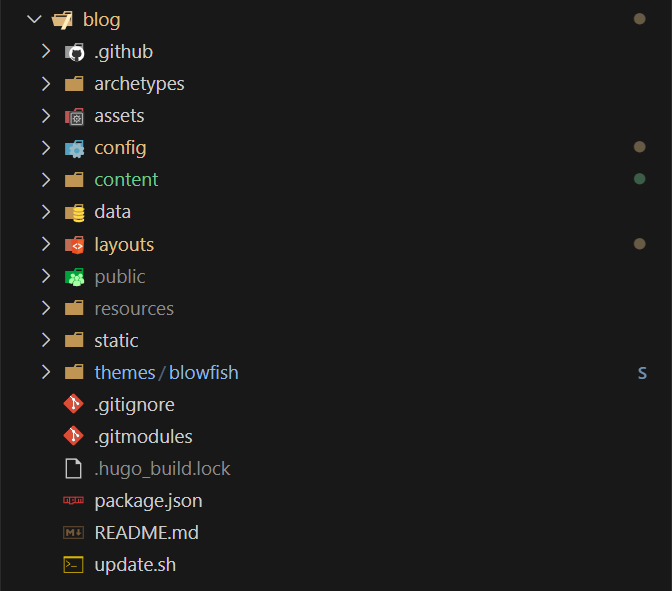
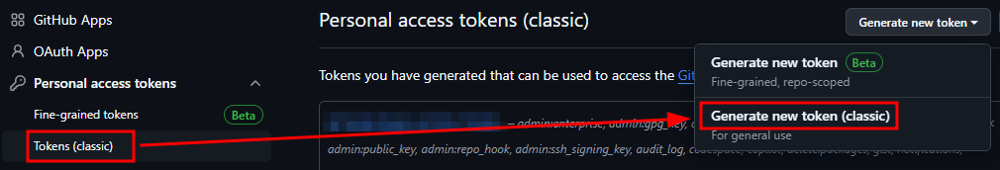
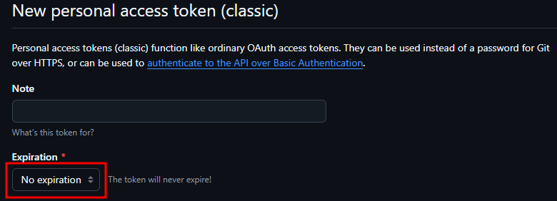
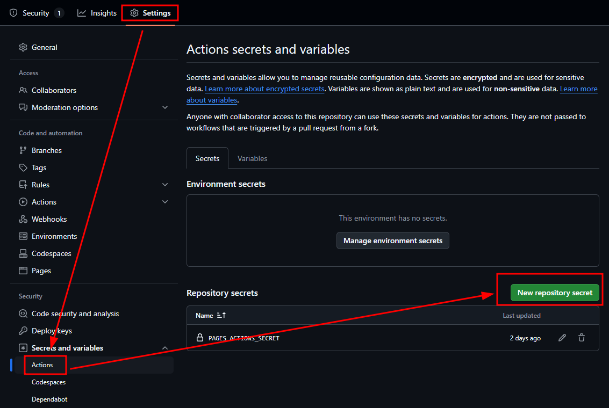
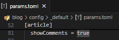
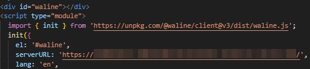
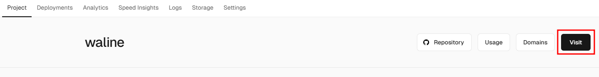

## Project Dependencies

Farmework: [hugo](https://gohugo.io/)



Theme: [blowfish](https://blowfish.page/)



## Installation Guide

Referencing the Blowfish theme [Installation and Configuration](https://blowfish.page/zh-cn/docs/installation/) In the article [Install using Git submodules](https://blowfish.page/zh-cn/docs/installation/#%E4%BD%BF%E7%94%A8-git-%E5%AD%90%E6%A8%A1%E5%9D%97%E5%AE%89%E8%A3%85), follow [Set up the theme's configuration file](https://blowfish.page/zh-cn/docs/installation/#%E8%AE%BE%E7%BD%AE%E4%B8%BB%E9%A2%98%E7%9A%84%E9%85%8D%E7%BD%AE%E6%96%87%E4%BB%B6) , configure your own parameters. You can copy`theme/blowfish/`from the path`exampleSite/`Copy the files and folders from the directory to the project root directory, and then gradually add new content based on this. The directory is as follows:




## Automatic Deployment

### Prepare the repository

1. **Repository A**: on GitHub as '`账户名称.github.io`Create a repository named (or on other platforms like Gitee, for example: GitHub account name: MortyZhaoy, new repository name: MortyZhaoy.github.io). The purpose of this repository is to store the static files of the website generated by Hugo.

2. **Repository b**: Create a repository with a random name on GitHub to store`hugo new site .`the files generated later, including personal blog markdown files. Since it contains personal markdown files, it can be set as a private repository. This repository also needs to add a workflow for automatic building and deployment.

### Prepare token

1. On the GitHub user "Settings" → "Developer Settings" → "Personal access token" → "Token (classic)" page, create a new token as shown in the following image:





2. In**Repository b**the 'Settings' → 'Secrets and variables' → 'Actions' → 'New repository secret', fill in 'PAGES\_ACTIONS\_SECRET' in the Name field, and fill in the entire content (including the leading and trailing text) of the token (the value generated from the token created in the previous step) in the Value field, then click Add secret. The name 'PAGES\_ACTIONS\_SECRET' filled in the Name field will be used in the GitHub Actions YAML configuration file.



### Implement Deployment

Create a new`.github/workflows/gh-pages.yml`file in the root directory of the project, with the content as shown in the following image:`personal_token`属性的"PAGES\_ACTIONS\_SECRET"为上一步配置的secret变量名称，`external_repository`Attribute filling**Repository A**Name:

```YAML
name: deploy github pages
on:
  push:
    branches:
      - main
jobs:
  deploy:
    runs-on: ubuntu-latest
    steps:
      - uses: actions/checkout@v2
        with:
          submodules: true
          fetch-depth: 0
      - name: Setup Hugo
        uses: peaceiris/actions-hugo@v2
        with:
          hugo-version: 'latest'
      - name: Build Hugo
        run: hugo --minify
      - name: Deploy Pages
        uses: peaceiris/actions-gh-pages@v3
        with:
          external_repository: MortyZhaoy/MortyZhaoy.github.io
          personal_token: ${{ secrets.PAGES_ACTIONS_SECRET }}
          publish_dir: ./public
          publish_branch: main

```

At this point, when new content is pushed to**Repository b**the repository, it will automatically build and push to repository a, achieving automatic deployment.

## Additional Feature Configuration

### Comment System

Waline comment system,[Official Link](https://waline.js.org/)

LeanCloud，[Official Link](https://console.leancloud.app/apps)

Free deployment, tutorial reference from the official site [Quick Start](https://waline.js.org/guide/get-started/)

You can successfully deploy by following the official 'Quick Start' tutorial.`config/_default/params.toml`The configuration for Blowfish is as follows:



The serverURL configuration field for Waline should be filled in as[vercel](https://vercel.com/)the address of the page that you are redirected to after clicking the Visit button under the projects interface with the project name created in the Waline quick start tutorial. As shown in the figure below:





## Reference

1. [How to Build a Personal Blog with GitHub Pages + Hugo](https://krislinzhao.github.io/docs/create-a-wesite-using-github-pages-and-hugo/)

2. [Adding Waline Comment System to Hugo Blog](https://mostima.blog/blog/waline-comment-system/)

3. [Using Waline Comments in the Blog](https://hetong-re4per.com/posts/use-waline-comment-on-hugo/)
