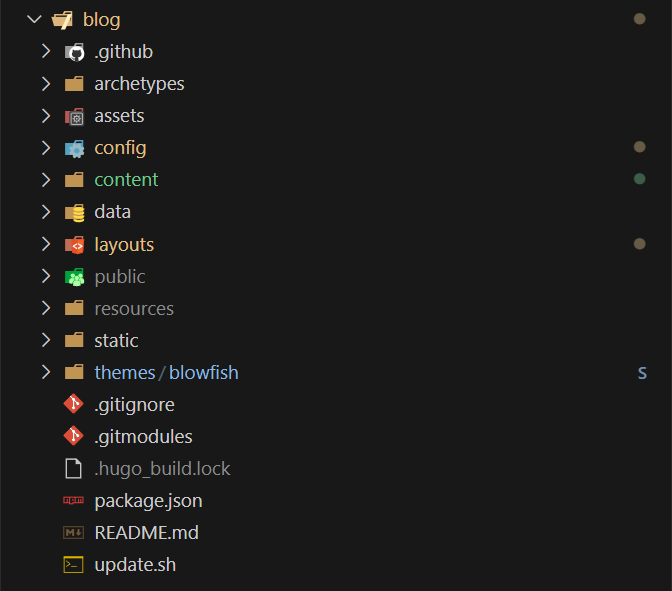
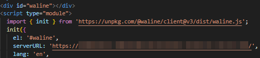
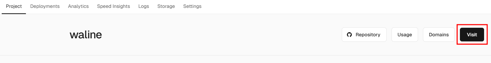

## 工程依赖

  Farmework: [hugo](https://gohugo.io/)

  

  Theme: [blowfish](https://blowfish.page/)

  

## 安装指南

  参考blowfish主题的 [安装和配置](https://blowfish.page/zh-cn/docs/installation/) 文章中的 [使用 Git 子模块安装](https://blowfish.page/zh-cn/docs/installation/#%E4%BD%BF%E7%94%A8-git-%E5%AD%90%E6%A8%A1%E5%9D%97%E5%AE%89%E8%A3%85)，按照 [设置主题的配置文件](https://blowfish.page/zh-cn/docs/installation/#%E8%AE%BE%E7%BD%AE%E4%B8%BB%E9%A2%98%E7%9A%84%E9%85%8D%E7%BD%AE%E6%96%87%E4%BB%B6) ，配置自己的参数。可以将`theme/blowfish/`路径下的`exampleSite/`目录下的文件及文件夹拷贝到工程根目录下，之后在此基础下逐步添加新内容。目录如下：




## 自动部署

### 准备仓库

  1. **仓库a**：github上以“`账户名称.github.io`”为名称的仓库（或者gitee等其他平台的，例如：github账户名称：MortyZhaoy，新建仓库名称：MortyZhaoy.github.io）。该仓库的作用用于存放hugo生成的网站的静态文件。

  2. **仓库b**：github上新建一个随机名称的仓库，用于存放`hugo new site .`后生成的文件，包括个人的博客的markdown文件。由于包含个人的markdown文件，可以将其设置成私有仓库。该仓库还需要添加工作流，用于自动构建，并部署。

### 准备token

  1. Github用户"Settings"→"Developer Settings"→"Personal access token"→"Token(classic)"页面按照如下图方式新建：

  

  

  2. 在**仓库b**的“Settings”→“Secrets and vriables”→ “Actions”→“New repository secret”，在Name中填写“PAGES_ACTIONS_SECRET”，在Value中填写token（上一步骤中新建的token后生成的值）中的全部内容（包括头尾的文字），然后Add secret。Name中填写的PAGES_ACTIONS_SECRET”名称将会在github action的YAML配置文件中使用。

  

### 实现部署

  在工程根目录下新建`.github/workflows/gh-pages.yml`文件，内容如下图所示：`personal_token`属性的"PAGES_ACTIONS_SECRET"为上一步配置的secret变量名称，`external_repository`属性填写**仓库a**的名称：

  ```YAML
  name: deploy github pages
  on:
    push:
      branches:
        - main
  jobs:
    deploy:
      runs-on: ubuntu-latest
      steps:
        - uses: actions/checkout@v2
          with:
            submodules: true
            fetch-depth: 0
        - name: Setup Hugo
          uses: peaceiris/actions-hugo@v2
          with:
            hugo-version: 'latest'
        - name: Build Hugo
          run: hugo --minify
        - name: Deploy Pages
          uses: peaceiris/actions-gh-pages@v3
          with:
            external_repository: MortyZhaoy/MortyZhaoy.github.io
            personal_token: ${{ secrets.PAGES_ACTIONS_SECRET }}
            publish_dir: ./public
            publish_branch: main

  ```

至此当在**仓库b**中push新内容将会自动构建并推送至仓库a中，实现自动部署。

## 额外功能配置

  ### 评论系统

  waline评论系统，[官方链接](https://waline.js.org/)

  LeanCloud，[官方链接](https://console.leancloud.app/apps)

  免费的部署，教程参考官方 [快速上手](https://waline.js.org/guide/get-started/)

  完全按照官方的“快速上手”教程操作就可以完美部署成功。`config/_default/params.toml`在blowfish的配置如下:

  

  waline的serverURL配置字段，应该填写成[vercel](https://vercel.com/)中，按照Waline快速上手教程中创建的工程名称下的projects界面下的Visit按钮，点击后跳转的页面地址。如下图所示：

  

  

## 参考

 1. [如何用 GitHub Pages + Hugo 搭建个人博客](https://krislinzhao.github.io/docs/create-a-wesite-using-github-pages-and-hugo/)

 2. [Hugo 博客添加 Waline 评论系统](https://mostima.blog/blog/waline-comment-system/)

 3. [在博客中使用 waline 评论](https://hetong-re4per.com/posts/use-waline-comment-on-hugo/)


